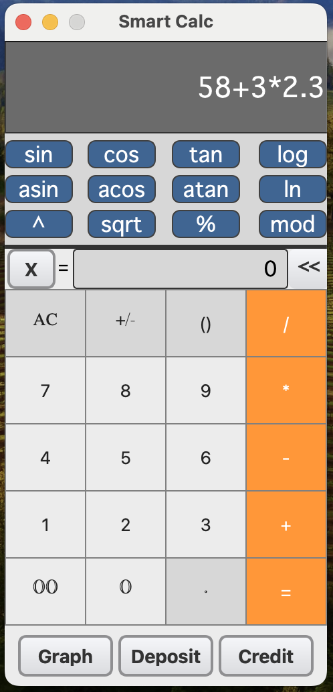
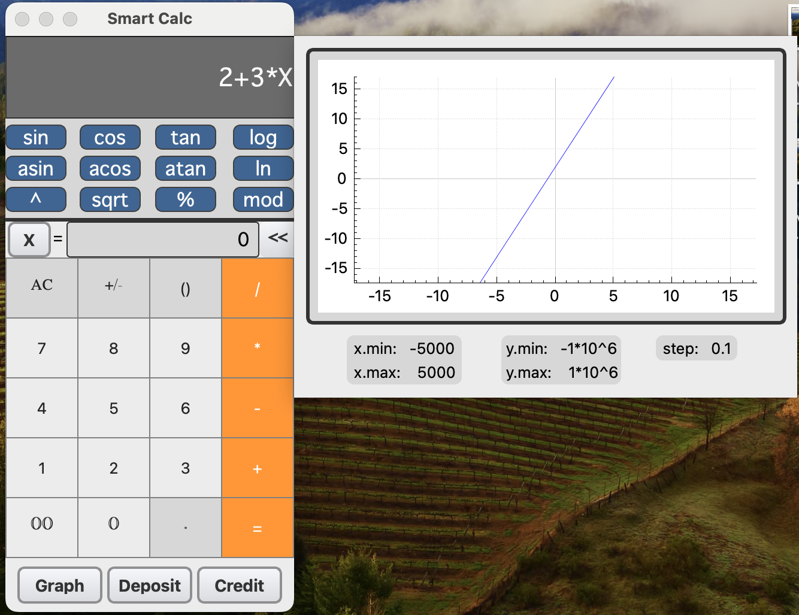
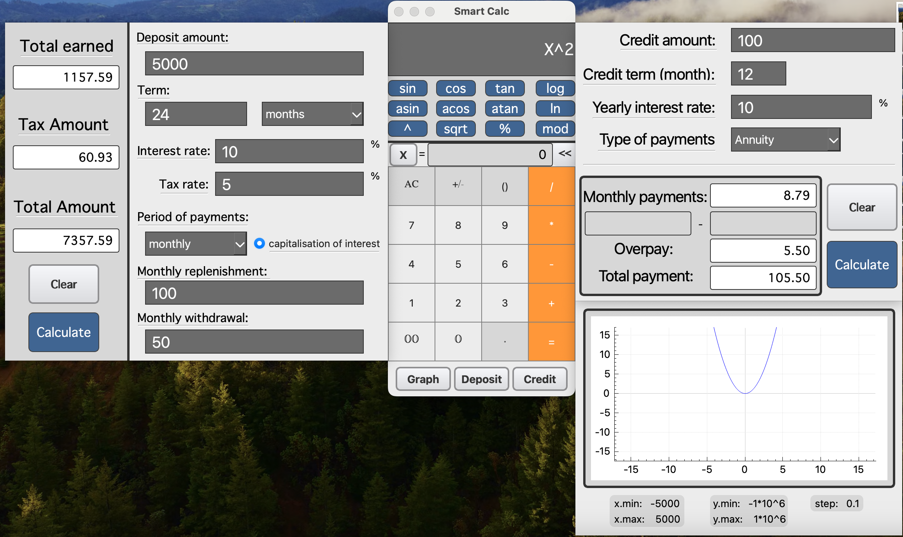

# SmartCalc v1.0

## Описание

SmartCalc v1.0 - это многофункциональный калькулятор для MacOS, реализованный на языке C стандарта C11 и с использованием Qt для графического интерфейса. Программа предназначена для выполнения различных математических вычислений, включая арифметические операции, функции и построение графиков.

## Возможности

Вычисление скобочных арифметических выражений в инфиксной, префиксной и постфиксной нотациях.
Поддержка целых и вещественных чисел, в том числе в экспоненциальной записи.
Графический интерфейс пользователя для удобства работы.
Построение графиков функций с переменной x.
Расширенные функции, включая кредитный и депозитный калькуляторы.

## Внешний вид программы 

## Установка

Программа поддерживает стандартные цели GNU Makefile: all, install, uninstall, clean, dvi, dist, test, gcov_report. 

Для установки выполните:

### make install

## Использование

Запустите программу из каталога установки. Введите выражение в поле ввода и нажмите = для вычисления. Для построения графика введите функцию от x и выберите соответствующий режим. Для использования кредитного и депозитного калькулятора выберите соответствующие режимы.

## Тестирование

Выполните:

### make test

для запуска unit-тестов, которые покрывают основные модули программы.

### make gcov_report 

для получения отчета о покрытии кода тестами.

## Структура Проекта

src: Исходный код программы.
frontend: Графический интерфейс пользователя, разработанный с использованием Qt.
backend: Логика и алгоритмы калькулятора.

## Конфигурация

C11 стандарт языка C с использованием gcc.
Соответствие Google Style при написании кода.
Поддержка Linux (GTK+, Qt) и Mac (GTK+, Qt и другие).

Примечание: Проект SmartCalc v1.0 был создан как часть образовательного процесса и направлен на демонстрацию навыков программирования на C и работы с графическими интерфейсами пользователя.